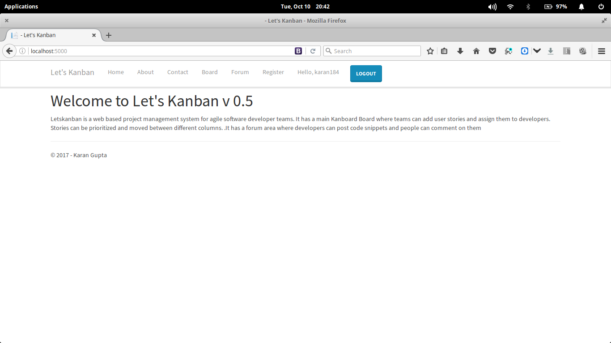
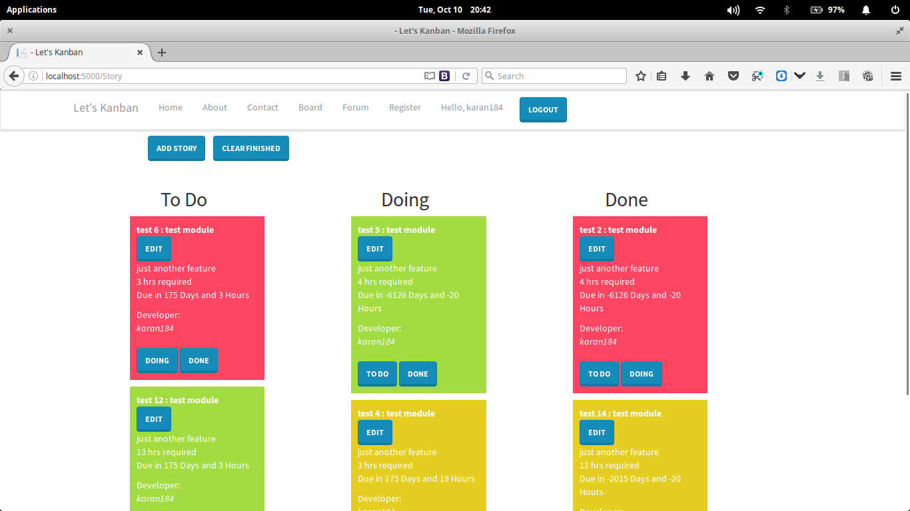
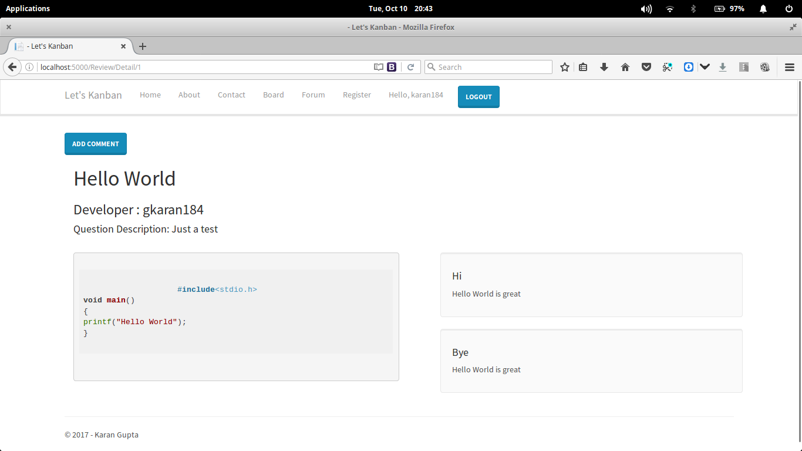
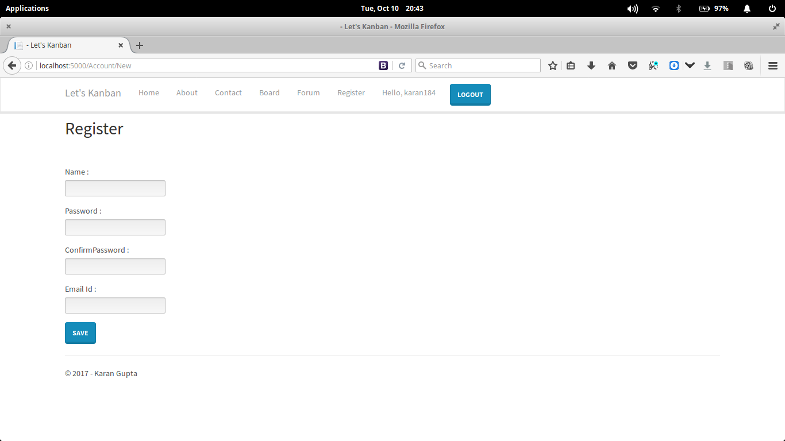

# Lets Kanban #

Letskanban is a web based project management system for agile software developer teams.

- It has a main Kanboard Board where teams can add user stories and assign them to developers. Stories can be prioritized and moved between different columns.

- It has a forum area where developers can post code snippets and people can comment on them.
 
Landing Page 

Board 

Forum

Account Management
